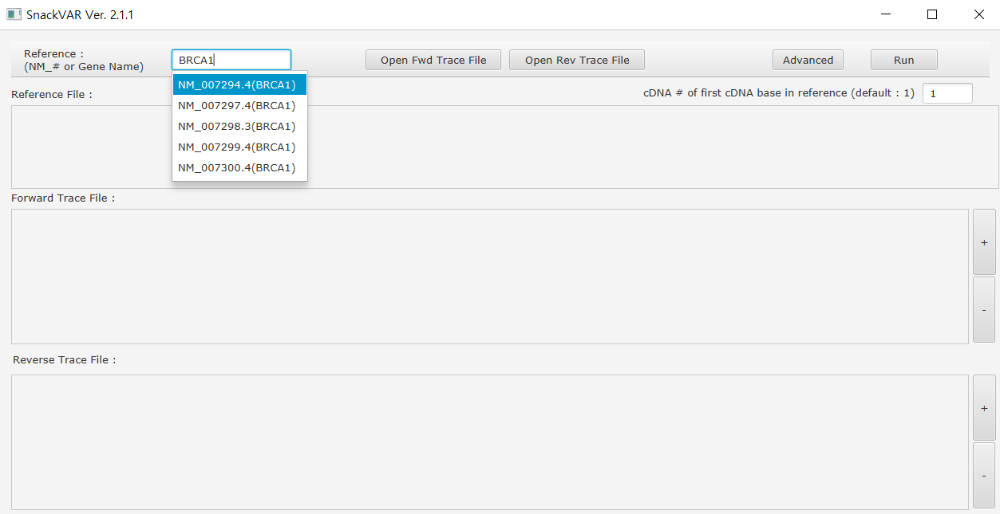
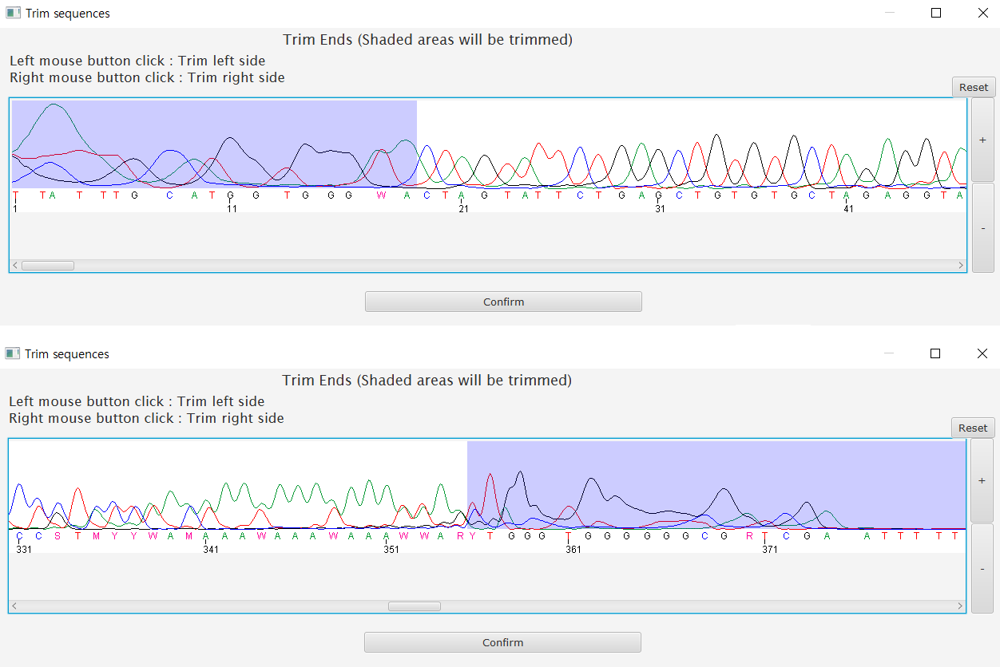
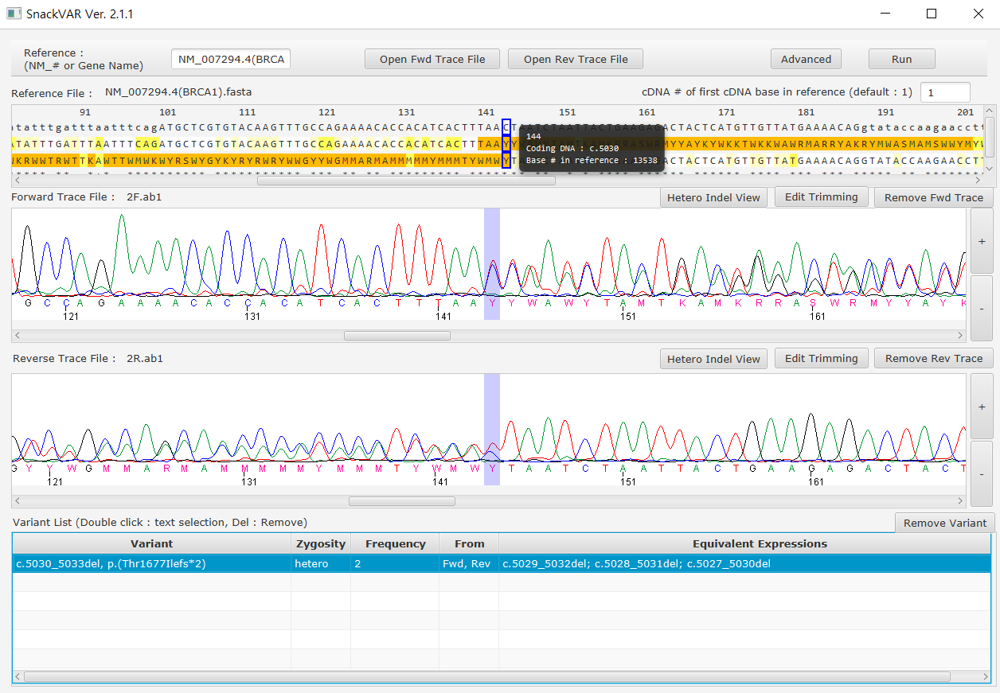
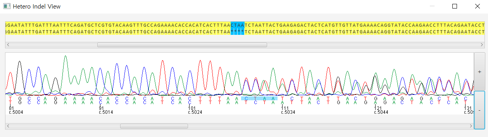

SnackVar Ver 2.1.1
======================
SnackVar is a free software for Sanger sequencing analysis in clinical environment. 
It supports automatic detection of variants including SNVs and indel variants (homozygous and heterozygous). 
Detected variants are provided in the form of HGVS (Human Genome Variation Society) nomenclature.

# 1. How to Run
1. You need to have [Java](https://www.java.com) installed.(Version 8 or higher)
2. Download SnackVar_V2.1.1.zip and unzip. (Download : Release tab above)
3. Run  
Windows : Run.bat or SnackVAR.jar (If not run by double click, right click-> open with -> JAVA) 
Linux, Mac : java -jar SnackVAR.jar

# 2. How to Use
[**You can download and watch SnackVar_Demo.mp4**](SnackVar_Demo.mp4)

Using SnackVar is quite straightforward. 

1. Choose reference sequence(RefSeq or gene name) 
2. Open forward and/or reverse trace file 
3. Trim the low-quality ends of trace file 

Proper trimming is important for the correct identification heterozygous indel variant. 
Since bases with double peaks have low phred score, initial suggestion of SnackVar is to trim out superimposed area generated by heterozygous indel variant. 
In cases with heterozygous indel variants, users should manually adjust the trimming in order to include maximal number of valid bases (including double peaks) and minimal number of noise signals. 
Figure above shows an example of desirable trimming.  

4. Click 'Run' Button 
5. Results are shown as below 

**Heterozygous Indel View Mode (by clicking "Hetero Indel View")**

# 3. Parameter optimization
Generally SnackVar works fine with default parameters. 
However, parameters described below could be adjusted for the refinement of results. 
1. Cutoff for double peak detection (Advanced button) 
To detect somatic variants, lower value than default value, such as 0.1~0.2 may be required. 
This adjustment could result in increased number of false positive variant calls.  
2. Gap opening penalty (Advanced button) 
Manual adjustment of gap opening penalty is not necessary. 
When a higher value of gap opening penalty is required, SnackVar automatically applies a higher gap opening penalty and notifies the user with a popup that the heterozygous indel optimization mode is activated.  

# 4. Utilized Libraries
BioJAVA Legacy  (https://github.com/biojava/biojava-legacy)

